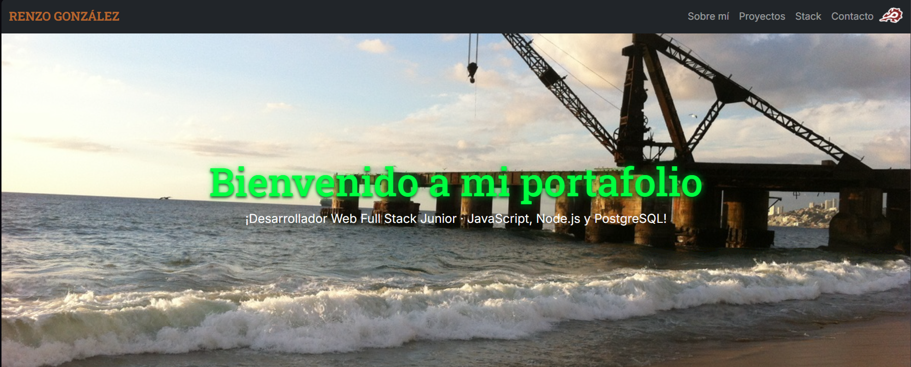

# Mi Portafolio

Sitio web personal donde muestro quién soy, mis proyectos y mis habilidades como Desarrollador Web Full Stack Junior.

🔗 **Ver sitio en vivo:** [renzo-gonzalez.vercel.app](https://renzo-gonzalez.vercel.app)

## Tecnologías utilizadas

- HTML5
- CSS3
- JavaScript
- Bootstrap

## Secciones

- Presentación (hero)
- Sobre mí
- Certificado
- Proyectos
- Stack tecnológico
- Contacto

## Cómo verlo localmente

1. Clona este repositorio
2. Abre `index.html` en tu navegador

## Autor

**Renzo González**
- GitHub: [@R-gonzalez-F](https://github.com/R-gonzalez-F)
